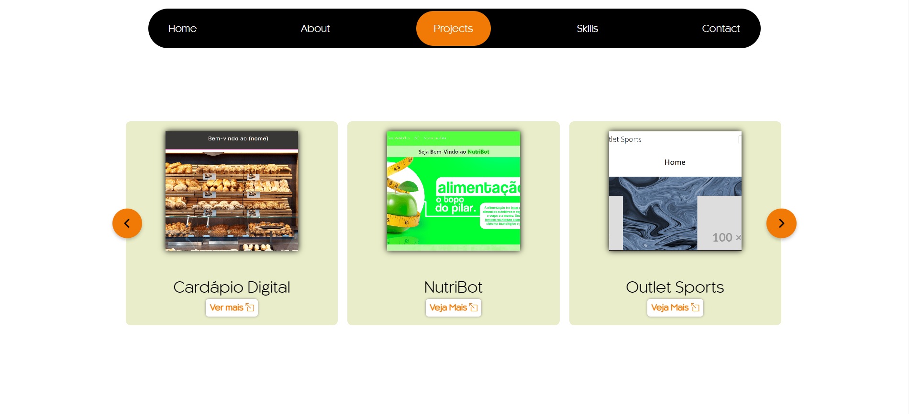

Portfólio Pessoal

Descrição: Este é o meu mais recente portfólio, desenvolvido utilizando HTML, JavaScript e SCSS, com Parcel como pre-processador. O site foi projetado para destacar minhas habilidades e projetos, oferecendo uma experiência visualmente atraente e interativa.

Funcionalidades:

Carrossel de Imagens: Navegue por uma galeria de imagens dinâmica e responsiva, que exibe projetos e conquistas de forma envolvente.
Animações de Entrada: Experimente animações suaves e elegantes à medida que o conteúdo entra em cena, proporcionando uma experiência de usuário moderna e atraente.
Botões Interativos: Utilize botões com feedback visual e efeitos interativos, melhorando a navegação e a usabilidade do site.
Envio de Emails: Funcionalidade integrada para envio de emails, permitindo contato direto e fácil com os visitantes.
Tecnologias Utilizadas:

HTML: Estrutura básica e semântica do site, garantindo uma base sólida e acessível.
JavaScript: Implementação de funcionalidades interativas e dinâmicas, enriquecendo a experiência do usuário.
SCSS: Pré-processador CSS que facilita a criação de estilos avançados e a manutenção do código.
Parcel: Ferramenta de build que otimiza o processo de desenvolvimento e gerenciamento de dependências.
Objetivo: O portfólio foi criado para exibir de maneira elegante e profissional minhas habilidades técnicas e projetos, proporcionando uma plataforma visualmente impactante e funcional.

link: https://meu-portifolio-coral.vercel.app/